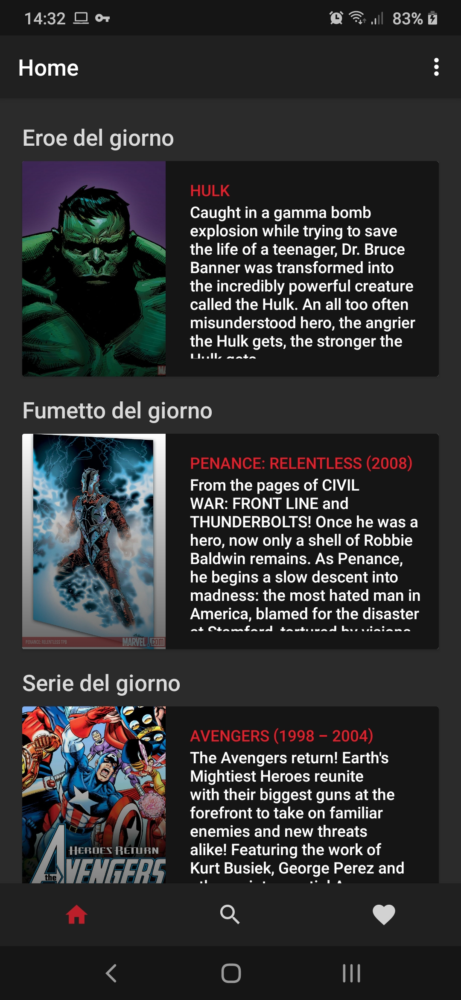
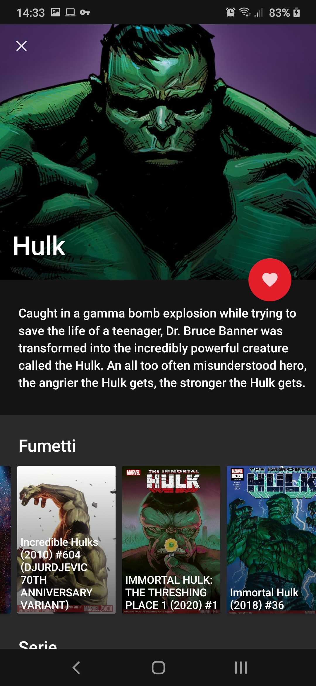
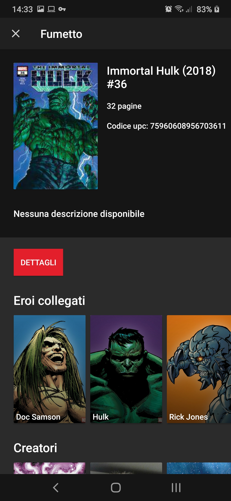

L’applicazione sui fumetti Marvel nasce come progetto universitario di Ingegneria Informatica. I co-autori di questo lavoro sono Adrian Minut, Pierciro Caliandro, Gian Marco Falcone e Francesco Fanali. 

L'applicazione si connette al sito ufficiale di Marvel e mostra all'utente informazioni su fumetti, autori, saghe ed eventi. Il lavoro svolto è stato prevalentemente di frontend, volendo fornire all'utente un'interfaccia grafica gradevole, intuitiva e curata nelle animazioni.
In particolare, sono state implementate le seguenti funzionalità:

* Tema dell'interfaccia grafica;
* Design dell'applicazione basato su tre pagine principali;
* Modalità di visualizzazione dei singoli elementi nel dettaglio;
* Animazioni ed effetti di transizione

In aggiunta, è stato implementato anche un piccolo database tramite Room per poter memorizzare i preferiti. 

Per approfondimenti, è disponibile il [repository GitHub](https://github.com/Tiburtina-Valley/MarvelHeroes)