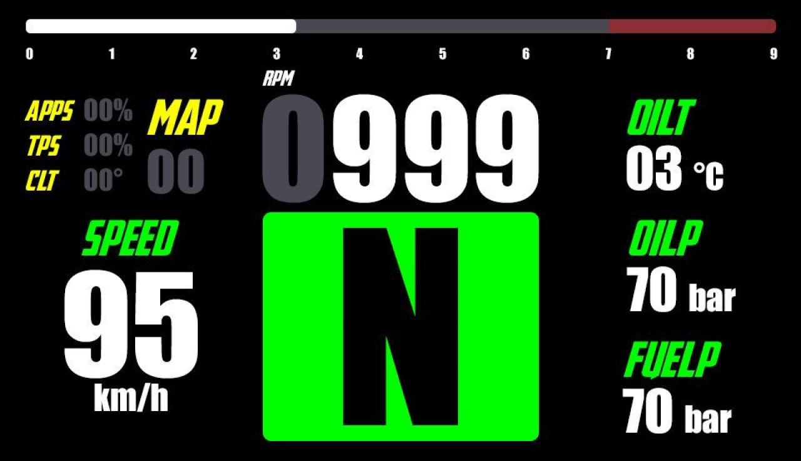

Tra le attività svolte come membro di un team universitario di Formula SAE, nell’ambito della grafica, rientrano: 
- Il progetto di design per la dashboard della vettura da corsa. 
- Il concept della livrea della vettura, cercando di mitigare i diversi gusti del team. 
Per la dashboard è stato realizzato un progetto grafico. Nel corso del lavoro è stata assegnata una priorità alla leggibilità delle diverse informazioni mostrate sullo schermo, in modo da far risaltare le più rilevanti al pilota. Si è cercato, inoltre, di agevolare la velocità di lettura utilizzando in modo strategico colori e grandezze degli elementi visualizzati. 

L’implementazione del primo progetto grafico nel dispositivo elettronico di destinazione ha portato a successive modifiche pratiche ed evoluzioni da parte del team di ingegneri (Paolo Melissari e Andrea Crescenzi) che vi hanno lavorato, ai fini delle esigenze di guida e di fattibilità.

Per lo studio della livrea è stato utilizzato il modello 3D realizzato dal team di Formula SAE. Sono stati ripresi i colori del team (verde, nero e bianco con l’aggiunta del rosso) e si è cercato di mantenere un aspetto il più essenziale possibile.

.")
